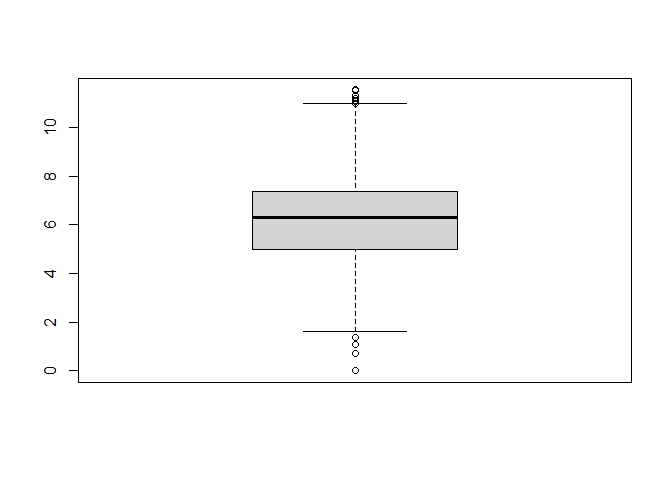
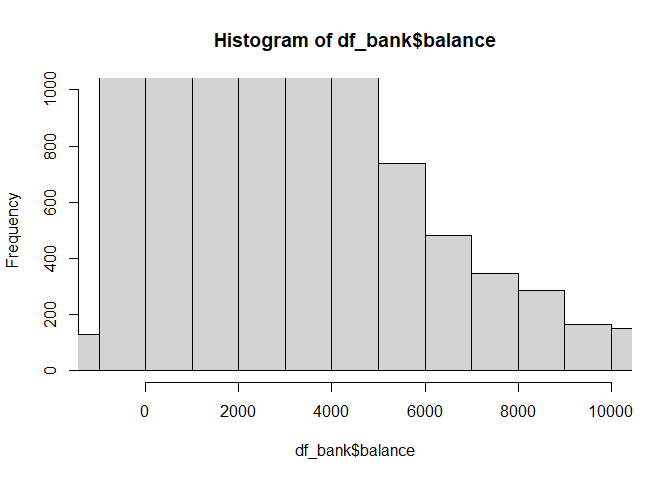
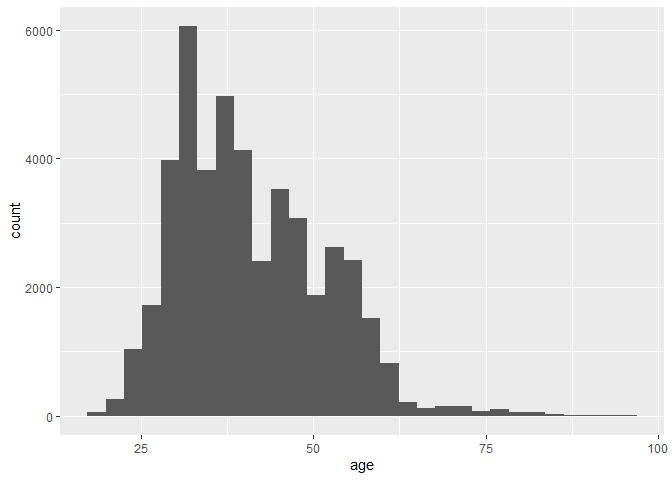
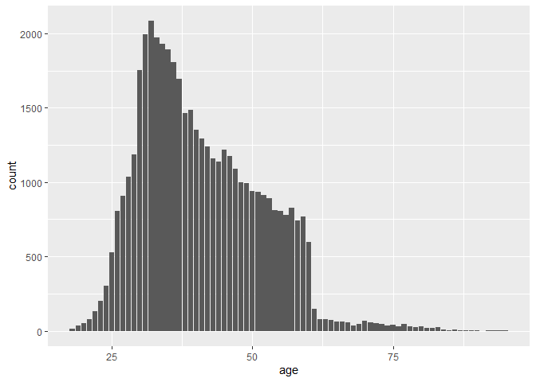
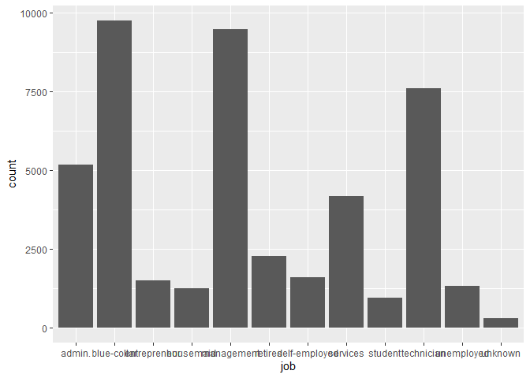
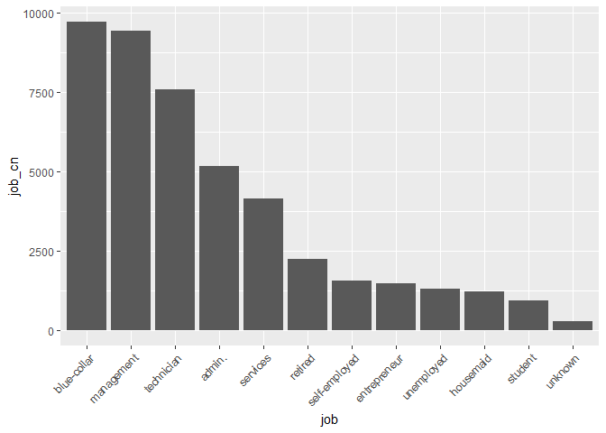
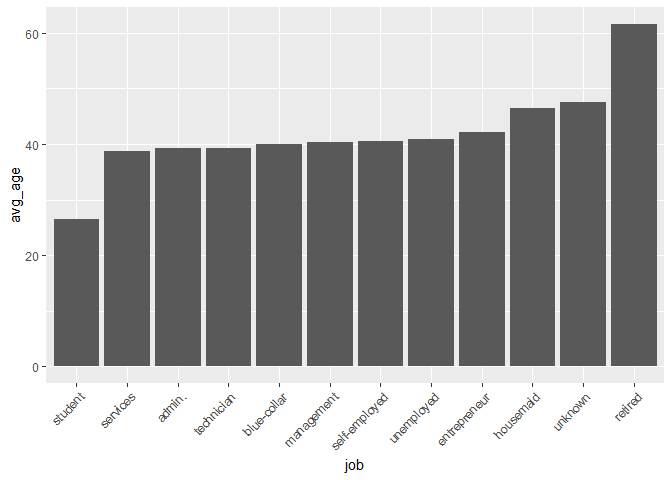
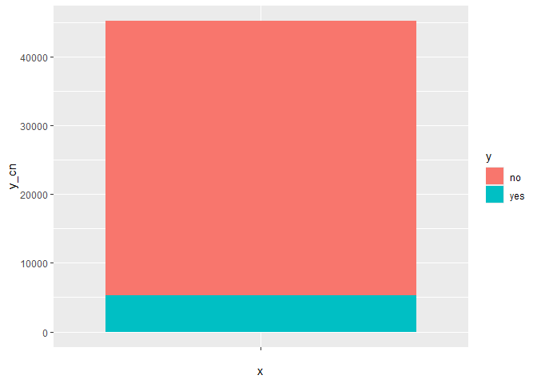
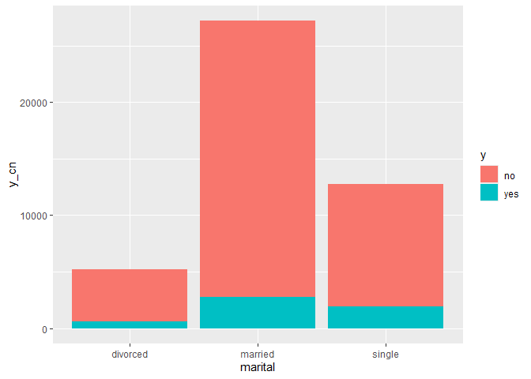
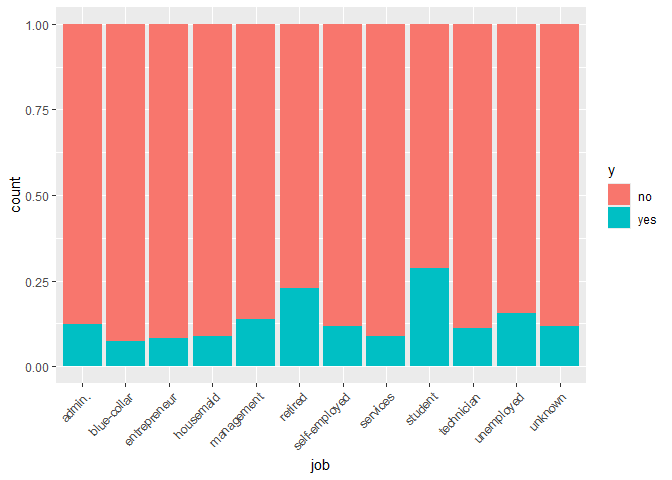

Exploritory Data Analysis
================

# EXECUTIVE SUMMARY

The bank should pursue a marketing campaign strategy where they target
retired people to sell term-deposits. This sector converts at 22.79%.
Also this sector makes logical sense, as we know this section will have
a lot of money to invest, so their investments may be larger.

If the bank wanted to maximize the number of term deposits, they could
target many retired people. If they wanted to focus on high ROI
(i.e. from high conversion rate), then we could continue to subset
retired people, to find sub-sectors that convert at an even higher rate.

# ANALYSIS METHODOLOGY

## RESEARCH AIM: Find New Customers

- We can use the information we know about existing customers, to
  specifically target new customers.
- We know which variables result in customers purchasing term deposit
  account.
- These customers are super-valuable, as term deposits allow the bank to
  lend out money at higher rates.
- By being specific, we can do a phone and mail campaign, which is
  expensive in general, but will be highly-targetted, which will keep
  costs down, and maximize the response rate.
- If we use the variables we can purchase from data brokers (i.e.
  demographics), we could target similar new customers

## RESEARCH OBJECTIVE 1: Determine Which Customers Are the Most Likely to Purchase Term Deposits?

- **Research Question:** Which variables predict term-deposits?

## STAKEHOLDERS: Bank’s marketing team Bank’s finance department

## ACTIONABILITY: New outreach campaign

## BUSINESS VALUE: Estimated \$500 in profit, from term deposit customers.

*NOTE: This is made up. In a real business scenario, I would use
available data to calculate this.*

Estimated \$500 profits, comes from the ability to lend out this money
and make more profits with other companies.

# ANALYSIS

``` r
library(ggplot2)
library(magrittr)
library(forcats)
library(dplyr)
```

    ## 
    ## Attaching package: 'dplyr'

    ## The following objects are masked from 'package:stats':
    ## 
    ##     filter, lag

    ## The following objects are masked from 'package:base':
    ## 
    ##     intersect, setdiff, setequal, union

``` r
df_bank <- read.csv("bank-full.csv", sep=";")
```

## IMPORTING/INSPECTING DATA

``` r
nrow(df_bank)
```

    ## [1] 45211

``` r
ncol(df_bank)
```

    ## [1] 17

``` r
str(df_bank)
```

    ## 'data.frame':    45211 obs. of  17 variables:
    ##  $ age      : int  58 44 33 47 33 35 28 42 58 43 ...
    ##  $ job      : chr  "management" "technician" "entrepreneur" "blue-collar" ...
    ##  $ marital  : chr  "married" "single" "married" "married" ...
    ##  $ education: chr  "tertiary" "secondary" "secondary" "unknown" ...
    ##  $ default  : chr  "no" "no" "no" "no" ...
    ##  $ balance  : int  2143 29 2 1506 1 231 447 2 121 593 ...
    ##  $ housing  : chr  "yes" "yes" "yes" "yes" ...
    ##  $ loan     : chr  "no" "no" "yes" "no" ...
    ##  $ contact  : chr  "unknown" "unknown" "unknown" "unknown" ...
    ##  $ day      : int  5 5 5 5 5 5 5 5 5 5 ...
    ##  $ month    : chr  "may" "may" "may" "may" ...
    ##  $ duration : int  261 151 76 92 198 139 217 380 50 55 ...
    ##  $ campaign : int  1 1 1 1 1 1 1 1 1 1 ...
    ##  $ pdays    : int  -1 -1 -1 -1 -1 -1 -1 -1 -1 -1 ...
    ##  $ previous : int  0 0 0 0 0 0 0 0 0 0 ...
    ##  $ poutcome : chr  "unknown" "unknown" "unknown" "unknown" ...
    ##  $ y        : chr  "no" "no" "no" "no" ...

``` r
head(df_bank)
```

    ##   age          job marital education default balance housing loan contact day
    ## 1  58   management married  tertiary      no    2143     yes   no unknown   5
    ## 2  44   technician  single secondary      no      29     yes   no unknown   5
    ## 3  33 entrepreneur married secondary      no       2     yes  yes unknown   5
    ## 4  47  blue-collar married   unknown      no    1506     yes   no unknown   5
    ## 5  33      unknown  single   unknown      no       1      no   no unknown   5
    ## 6  35   management married  tertiary      no     231     yes   no unknown   5
    ##   month duration campaign pdays previous poutcome  y
    ## 1   may      261        1    -1        0  unknown no
    ## 2   may      151        1    -1        0  unknown no
    ## 3   may       76        1    -1        0  unknown no
    ## 4   may       92        1    -1        0  unknown no
    ## 5   may      198        1    -1        0  unknown no
    ## 6   may      139        1    -1        0  unknown no

## BANK BALANCE

``` r
df_bank %>%
ggplot() +
  geom_histogram(aes(x=balance))
```

    ## `stat_bin()` using `bins = 30`. Pick better value with `binwidth`.

<!-- -->

``` r
summary(df_bank$balance)
```

    ##    Min. 1st Qu.  Median    Mean 3rd Qu.    Max. 
    ##   -8019      72     448    1362    1428  102127

``` r
boxplot(log(df_bank$balance))
```

    ## Warning in log(df_bank$balance): NaNs produced

    ## Warning in bplt(at[i], wid = width[i], stats = z$stats[, i], out =
    ## z$out[z$group == : Outlier (-Inf) in boxplot 1 is not drawn

<!-- -->
About normally distributed, when taking the logarithm.

``` r
hist(df_bank$balance, breaks = 100, xlim = c( -1000, 10000 ), ylim = c(0, 1000))
```

<!-- -->
Zooming in.

\##AGE

``` r
df_bank %>%
  ggplot(aes(x = age)) +
  geom_histogram( )
```

    ## `stat_bin()` using `bins = 30`. Pick better value with `binwidth`.

<!-- -->

``` r
df_bank %>%
  ggplot(aes(x = age)) +
  geom_bar()
```

<!-- -->

``` r
df_bank %>%
  group_by(age) %>%
  summarise(counting = n()) %>%
  arrange(desc(counting))
```

    ## # A tibble: 77 × 2
    ##      age counting
    ##    <int>    <int>
    ##  1    32     2085
    ##  2    31     1996
    ##  3    33     1972
    ##  4    34     1930
    ##  5    35     1894
    ##  6    36     1806
    ##  7    30     1757
    ##  8    37     1696
    ##  9    39     1487
    ## 10    38     1466
    ## # ℹ 67 more rows

\##JOB

``` r
df_bank %>%
  ggplot(aes(x = job)) +
  geom_bar()
```

<!-- -->

``` r
##### Jobs
df_bank %>%
  group_by(job) %>%
  summarize(job_cn = n()) %>%
  arrange(-job_cn) %>%
  mutate(job = factor(job, levels = job)) %>%

                    
  ggplot() +
  geom_col(aes(x = job, y = job_cn)) +
  theme(axis.text.x = element_text(angle = 45, vjust = 1, hjust = 1))
```

<!-- -->

\##JOB AGE

``` r
df_bank %>%
  group_by(job) %>%
  summarize(avg_age = mean(age)) %>%
  arrange(avg_age) %>%
  mutate(job = factor(job, levels = job)) %>%

                    
  ggplot() +
  geom_col(aes(x = job, y = avg_age)) +
  theme(axis.text.x = element_text(angle = 45, vjust = 1, hjust = 1))
```

<!-- -->

\##TERM DEPOSIT

``` r
summary(factor(df_bank$y))
```

    ##    no   yes 
    ## 39922  5289

``` r
df_bank %>%
  group_by(y) %>%
  summarise(y_cn = n()) %>%
  ggplot(aes(fill = y, x = "", y = y_cn)) +
  geom_bar(position = "stack", stat = "identity")
```

<!-- -->

\##Y Married

``` r
df_bank %>%
  group_by(y, marital) %>%
  summarise(y_cn = n()) %>%
  ggplot(aes(fill = y, x = marital, y = y_cn)) +
  geom_bar(position = "stack", stat = "identity")
```

    ## `summarise()` has grouped output by 'y'. You can override using the `.groups`
    ## argument.

<!-- -->

``` r
df_bank %>%
  ggplot(aes(x = job)) +
  geom_bar(aes(fill= y), position="fill") +
  theme(axis.text.x = element_text(angle = 45, vjust = 1, hjust=1))
```

<!-- -->

``` r
tmp <- df_bank %>%
  filter(job == "retired") %>%
  group_by(y) %>%
  summarise(retired  = n())

tmp
```

    ## # A tibble: 2 × 2
    ##   y     retired
    ##   <chr>   <int>
    ## 1 no       1748
    ## 2 yes       516

``` r
num <- 516
den <- (516 + 1748)

retired_y_prop = num / den

retired_y_prop
```

    ## [1] 0.2279152
